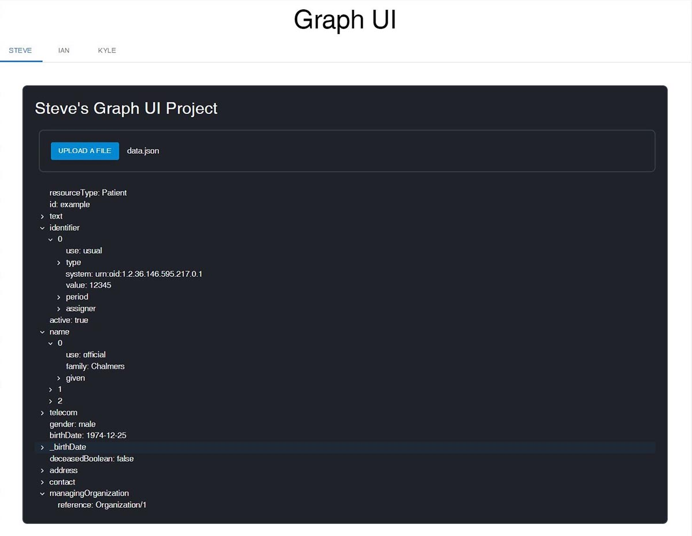

# Graph-UI

This is my fork of the main branch of the Graph UI project for Plenful's micro-internship with Open Avenues.  In this project, we built a web application to visualize a complex recursive data structure using Typescript, React, Material UI, and D3.js.

## Team
Sanjeev Vijayaraj, Project Leader\
Steve Han,  Software Developer Intern\
Ian Wong, Software Developer Intern\
Kyle Wu,  Software Developer Intern

## Live Demo

[Live demo deployed on Github Pages](https://stevehanstudio.github.io/graph-ui-clone)

## Screenshot


## Installation

- First clone this repository

```
git clone git@github.com:stevehanstudio/Graph-UI.git
```

- Next change into cloned folder, then
```
cd graph_lib
npm install
```

## Deployment

I've set this project up to deploy to Github pages.  To deploy, first edit package.json. The homepage key is current set to https://stevehanstudio.github.io/graph-ui-clone.  Change stevehanstudio to your Github username.  You can also change graph-ui-clone to another name if you like.  Next run the commands:

```
npm run predeploy
npm run deploy
```

## Notes:

- I downgraded to React version to 17.0.2.  As result, useId from React 18 is not available, so I modified Ian's code to use an arbitrary string instead of useId.

## Resources

* [Material UI installation doesn't work with React 18 (Stackoverflow)](https://stackoverflow.com/questions/71713111/mui-installation-doesnt-work-with-react-18)<br/>
* [Material UI tree view documentation](https://mui.com/material-ui/react-tree-view/).  I used the code for rich object as reference<br/>
* [How to create a type for complex JSON object in Typescript](https://dev.to/ankittanna/how-to-create-a-type-for-complex-json-object-in-typescript-d81)<br/>
* [Rendering objects in React (Stackoverflow)](https://stackoverflow.com/questions/45100477/how-to-render-a-object-in-react)<br/>
* [Material UI installation doesn't work with React 18 (Stackoverflow)](https://stackoverflow.com/questions/71713111/mui-installation-doesnt-work-with-react-18)<br/>
* [Material UI TreeView](https://mui.com/material-ui/react-tree-view/)<br/>
* [How to create a type for complex JSON object in Typescript](https://dev.to/ankittanna/how-to-create-a-type-for-complex-json-object-in-typescript-d81)<br/>
* [Rendering objects in React (Stackoverflow)](https://stackoverflow.com/questions/45100477/how-to-render-a-object-in-react)
* [Material UI installation doesn't work with React 18 (Stackoverflow)](https://stackoverflow.com/questions/71713111/mui-installation-doesnt-work-with-react-18)<br/>
* [Material UI tree view documentation.  I used the code for rich object as reference](https://mui.com/material-ui/react-tree-view/)<br/>
* [How to create a type for complex JSON object in Typescript](https://dev.to/ankittanna/how-to-create-a-type-for-complex-json-object-in-typescript-d81)<br/>
* [Rendering objects in React (Stackoverflow)](https://stackoverflow.com/questions/45100477/how-to-render-a-object-in-react)<br/>
* [D3.js Data Visualization Fundamentals - Hands On](https://www.udemy.com/course/d3jsbasics/)<br/>
* [Complete Git and GitHub guide - Master all Git features: commits, branches, merging, rebasing and squashing](https://www.udemy.com/course/git-and-github-complete-guide/) - Great course that goes under the hood of Git that helped me with the rebasing and merging.
